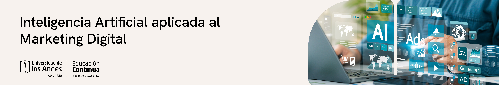

# Inteligencia Artificial aplicada al Marketing Digital

Curso práctico (24 horas) para profesionales y estudiantes que buscan usar IA, analítica y automatización en decisiones de marketing. Trabajamos con Python en Google Colab, herramientas generativas y casos reales para pasar de los datos a la acción.

## ¿Qué aprenderás?
- Diseñar segmentaciones y arquetipos con clustering clásico y asistido por IA.
- Construir y evaluar sistemas de recomendación, análisis de sentimiento y extracción de tópicos.
- Integrar IA generativa y NLP en flujos de contenido, fidelización y experiencia de cliente.
- Traducir hallazgos en decisiones medibles mediante pruebas estadísticas y dashboards ligeros.

## ¿Para quién es?
- Profesionales de marketing, CX, producto y ventas que necesitan acelerar la personalización.
- Líderes de datos o consultores que quieran estructurar soluciones de IA aplicadas a negocio.
- Estudiantes de posgrado o últimos semestres con interés en analítica aplicada. No se exige programación avanzada, sí disposición a experimentar con Python, Colab y prompts.

## Formato del curso
- Modalidad virtual, miércoles y jueves de 6:00 p.m. a 9:00 p.m.
- 8 sesiones sincrónicas de 3 horas con mezcla de concept briefs, demos guiadas y mini‑labs.
- Entregables cortos por módulo para documentar decisiones de segmentación, recomendación y comunicación.

## Metodología
- **Aprender haciendo:** cada bloque parte de un caso base y termina con un entregable replicable en tu organización.
- **Toolbox compartido:** notebooks en Colab, datasets de práctica y plantillas de prompts/briefs para reutilizar.
- **IA asistida:** uso intencional de ChatGPT u otras LLM para depurar código, crear insights visuales y documentar experimentos.

## Contenido resumido
1. **Kickoff y fundamentos (2 h):** Colab, flujos de datos, ética y quick wins con IA generativa.
2. **Segmentación inteligente (8 h):** K‑means, clustering jerárquico, validación, storytelling de arquetipos y sesión práctica.
3. **Recomendación y personalización (14 h):** modelos colaborativos y basados en contenido, NLP en español, análisis de sentimientos/tópicos, evaluación A/B y laboratorio final.

## Requisitos técnicos
- Cuenta de Google y acceso a Colab; Python 3 preinstalado en caso de trabajar localmente.
- Portátil con ≥4 GB RAM (ideal 8 GB). Conexión estable y auriculares.
- Recomendado (opcional): cuenta paga de ChatGPT u otra LLM para acelerar generación y revisión de código.

## Equipo docente
- **Ignacio Sarmiento-Barbieri:** Ph.D. Universidad de Illinois, profesor de la Facultad de Economía Uniandes e investigador en IA aplicada a economía urbana y bienes públicos.
- **Carlos Andrés Rodríguez Bayona:** Ingeniero industrial Uniandes, MBA Inalde, máster en Inteligencia Analítica de Datos; 25+ años liderando transformación comercial, CX analytics y programas de voz del cliente en LATAM.

## Cómo prepararte
1. Activa tu cuenta de Colab y revisa los notebooks de ejemplo antes de la primera sesión.
2. Define un reto propio (segmentación, recomendación, monitoreo de opinión) para trabajarlo como hilo conductor.
3. Llega con datos de referencia o utiliza los datasets provistos para practicar.
